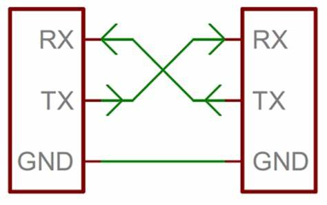

# UART Between Two ESP32 Boards

## Description

This project consists of two ESP32 devices communicating via UART: a **SLAVE** and a **MASTER**. The SLAVE reads an analog value from a potentiometer to determine the blink rate of an LED, displays the number of blinks on a 4-digit 7-segment display, and transmits the current delay value to the MASTER every second. The MASTER, acting as a Wi-Fi Access Point and web server, receives the delay value over UART and serves a live-updating web page displaying the current LED delay, allowing remote monitoring via any device connected to its Wi-Fi network.

## Table of Contents

1. [Hardware Setup](#hardware-setup)  
2. [Software](#software)  
3. [Installation](#installation)  
4. [Usage](#usage)  
5. [Common Problems](#common-problems)  
6. [Reference](#reference)  
7. [Contact](#contact)  

## Hardware Setup

### Components Required:
- 2 x Arduino ESP32 boards  
- Breadboard  
- Red LED  
- 200Ω resistor  
- Potentiometer  
- HS420561K-32 4-digit, 7-segment display  
- 4 × 330Ω resistors  
- 17 x male-to-female jumper wires  
- 3 x female-to-female jumper wires  
- Antenna (for MASTER board Wi-Fi signal)

Ensure both ESP32 boards are connected to power and that the antenna is attached to the MASTER board.



### UART Setup:
- Connect **GND (MASTER)** to **GND (SLAVE)**  
- Connect **GPIO16 (TX - MASTER)** to **GPIO17 (RX - SLAVE)**  
- Connect **GPIO17 (RX - MASTER)** to **GPIO16 (TX - SLAVE)**  
  - All 3 cables should be **female-to-female jumpers**

The MASTER board is now ready. Follow the remaining setup instructions for the SLAVE board.

### LED Setup:
- Connect **GPIO33 (ESP32)** → 200Ω resistor → LED (anode)  
- LED (cathode) → GND

### Potentiometer Setup:
- **GPIO36 (ESP32)** → middle pin of the potentiometer  
- **3.3V (3V3 pin)** → one side pin of the potentiometer  
- **GND** → other side pin of the potentiometer  

### HS420561K-32 Display Setup:
Refer to the following pinout diagram (top left to right is 12–7; bottom left to right is 1–6):


Before connecting, ensure that **display pins 12, 9, 8, and 6** each have a 330Ω resistor connected in series.

| Display Pin | ESP32 Pin |
|-------------|------------|
| 12          | 25         |
| 11          | 26         |
| 10          | 27         |
| 9           | 12         |
| 8           | 13         |
| 7           | 14         |
| 6           | 15         |
| 5           | 2          |
| 4           | 4          |
| 3           | 34         |
| 2           | 18         |
| 1           | 32         |

**Hardware Setup Complete**

## Software

Install the latest version of the Arduino IDE and the ESP32 board support package if you plan to upload code manually. If you're using pre-flashed boards, no installation is needed.

### Main Loop Snippet for MASTER:
```c++
void loop() {
  // Handle web client
  server.handleClient();

  // Read delay value from SLAVE if available
  if (SerialPort.available()) {
    delayValue = SerialPort.readStringUntil('\n'); // Read until newline
    delayValue.trim(); // Remove any trailing whitespace
    Serial.println("Received delay: " + delayValue);
  }
}

```

### Main Loop Snippet for SLAVE:
```c++
void loop() {
  ledDelay = analogRead(potPin);

  unsigned long currentMillis = millis();
  if (currentMillis - previousMillis >= ledDelay) {
    previousMillis = currentMillis;
    digitalWrite(ledPin, HIGH);
    blinkCount++;
    if (blinkCount > 9999) blinkCount = 0;
  } else {
    digitalWrite(ledPin, LOW);
  }

  // Display logic
  int digitD4 = blinkCount % 10;
  int digitD3 = (blinkCount / 10) % 10;
  int digitD2 = (blinkCount / 100) % 10;
  int digitD1 = (blinkCount / 1000) % 10;

  write_D1(); print_digit(digitD1); delay(1);
  write_D2(); print_digit(digitD2); delay(1);
  write_D3(); print_digit(digitD3); delay(1);
  write_D4(); print_digit(digitD4); delay(1);

  // Send delay value every 1 second
  if (millis() - lastSendTime >= 1000) {
    lastSendTime = millis();
    SerialPort.println(ledDelay); // Send current delay
  }
}
```

## Installation

There is no installation required for this project. Simply connect the **ESP32's** and the components, as described in the hardware setup and download the required Software.

## Usage

To use the project, follow these steps:
1. Plug in both **Arduino ESP32 DevKitC V4**s to a power source (via Micro USB).
2. The red light on the boards will turn on.
3. Connect to the board via Wi-Fi:  
   - **SSID** = `"dullyESP32"`  
   - **Password** = `"th3dully"`
4. Go to `http://192.168.1.22` on your web browser.


## Common Problems

If you run into issues, try the following troubleshooting steps:

- **Reboot the boards** by disconnecting and reconnecting the USB power.
- **Double-check all wiring connections**, especially UART (TX/RX), the LED, potentiometer, and 7-segment display.
- **Ensure all jumper wires are firmly connected** and none are loose or in the wrong GPIO.
- **Verify the USB cable supports data**, not just charging (for programming the board). Ensure both ESP32 boards are receiving sufficient power via USB.
- **Reconnect to the correct Wi-Fi network** (`dullyESP32`) on your device if the web page doesn’t load.
- **Use the Serial Monitor** in the Arduino IDE to debug UART messages from both the MASTER and SLAVE.
- **Re-upload the code** to the boards in case of corrupted flash or unexpected behavior.

These basic steps solve most common problems encountered during setup or runtime.

## Reference

[Setting up an ESP32 with Arduino IDE](https://www.youtube.com/watch?v=CD8VJl27n94) — Learn how to set up ESP32 microcontrollers in the Arduino IDE.

[Blink](https://docs.arduino.cc/built-in-examples/basics/Blink/#circuit) — Basic Arduino example to blink an LED.

[Starting Electronics](https://startingelectronics.org/beginners/arduino-tutorial-for-beginners/read-an-analog-input-with-arduino/#:~:text=Connect%20a%20potentiometer%20to%20an%20Arduino%20analog%20input,it%20in%20the%20Arduino%20IDE%20serial%20monitor%20window.) — Guide to reading analog input from a potentiometer.

[The Okelo](https://theokelo.co.ke/how-to-get-your-hs420361k-32-4-digit-7-segment-display-working-with-an-arduino/) — Setup guide for the HS420361K-32 4-digit 7-segment display.

[ESP32 Access Point and Router Connection Explained](https://www.youtube.com/watch?v=PGt_5xQo2_0&t=524s) — Explains setting up ESP32 as an access point or router.

[ESP32 Access Point Example (GitHub)](https://github.com/mo-thunderz/ESP32AccessPoint) — Code examples for ESP32 AP mode.

[ESP32 UART Communication Explained](https://microcontrollerslab.com/esp32-uart-communication-pins-example/) — Tutorial for UART communication between ESP32 boards.

[Transmit Data Using UART in ESP32](https://www.youtube.com/watch?v=TGusjcKSNIU&t=2s) — Video tutorial on serial communication between ESP32 boards.

## Contact

For questions or feedback, please reach out to:

**Email:** [abdullah.muhammad@magecontrol.com](mailto:abdullah.muhammad@magecontrol.com)

<!-- 
 ____        _ _       
|  _ \ _   _| | |_   _ 
| | | | | | | | | | | |
| |_| | |_| | | | |_| |
|____/ \__,_|_|_|\__, |
                 |___/ 
-->