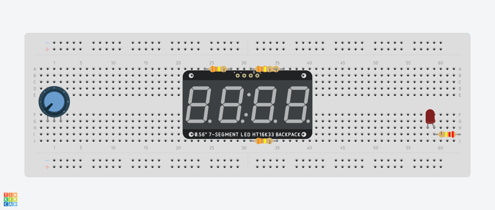
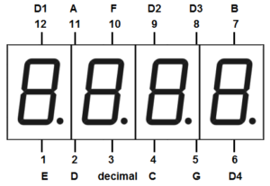

# Dynamic Bulb & Display

## Description

This project utilizes an **Arduino ESP32 DevKitC V4** to blink a red LED bulb. The blink rate is controlled by a potentiometer, allowing dynamic control over the blinking speed. The number of times the LED has blinked is displayed on a **HS420561K-32** 4-digit, 7-segment display. The system provides a simple way to visually monitor the blink count of the LED in real-time.

## Table of Contents

1. [Hardware Setup](#hardware-setup)
2. [Software](#software)
3. [Installation](#installation)
4. [Usage](#usage)
5. [Refrence](#refrence)
6. [Contact](#contact)

## Hardware Setup

### Commponents required:
- Arduino ESP32
- Bread board
- Red LED
- 200Ω resistor
- Potentiometer
- HS420561K-32 (4-digit, 7-segment)
- 330Ω resistor
- 17 male to female cables

Have your Arduino ESP32 connected to power.

Here is a how to set up your bread board:


***LED setup:*** Cable from pin 2(ESP32) to the 200Ω resistor input, resistor output to LED input, LED output to Ground(GND pin) via cable

***Potentiometer setup:*** 32 pin (ESP32) to middle pin (Potentiometer), 3.3V (3V3 pin) to anyother(left or right) potentiometer pin, Ground(GND) to last potentiometer pin

***HS420561K-32 Display setup:*** first understand the pinout (pin layout) of the display from the top left to right is 12 - 7, bottom left to right is 1 - 6. Like shown below (paying attention to the numbers 1 -12).



Now her is how to connect each of the Display pins to the ESP32 Pins. Before connecting make sure that Display pin numbers 12, 9, 8 and 6 have a 330Ω resistor connected.

| Display Pin | ESP32 Pin |
|----------|----------|
| 12 | 12 |
| 11 | 14 | 
| 10 | 33 | 
| 9 | 25 | 
| 8 | 26 | 
| 7 | 27 | 
| - | - | 
| 6 | 23 | 
| 5 | 22 | 
| 4 | 21 | 
| 3 | 19 | 
| 2 | 18 | 
| 1 | 17 | 

Hardware Setup Compleate

## Software

Install the latest version of the Arduino IDE and the ESP32 drivers if you plan to modify or create your own microboard. If you already have an ESP32 with the code pre-installed, then you don't need to download anything.

Here is a snippit of  main loop in the code:

```c++
void loop() 
{ 
  // Read the potentiometer value (0 to 4095)
  ledDelay = analogRead(potPin);

  // LED control (Non-blocking using millis)
  unsigned long currentMillis = millis();
  if (currentMillis - previousMillis >= ledDelay) {
    previousMillis = currentMillis;
    digitalWrite(ledPin, HIGH); // LED on
    blinkCount++;  // Increment the blink count each time the LED turns on
    if (blinkCount > 9999) {  // Reset the counter after 9999
      blinkCount = 0;
    }
    //Serial.println("high");
  } else {
    digitalWrite(ledPin, LOW);  // LED off
    //Serial.println("low");
  }

  // Break down blinkCount into digits
  int digitD4 = blinkCount % 10;       // Least significant digit (ones place)
  int digitD3 = (blinkCount / 10) % 10; // Tens place
  int digitD2 = (blinkCount / 100) % 10; // Hundreds place
  int digitD1 = (blinkCount / 1000) % 10; // Thousands place

  // Display digits
  write_D1();
  print_digit(digitD1);  // Display the thousands digit (D1)
  delay(1);

  write_D2();
  print_digit(digitD2);  // Display the hundreds digit (D2)
  delay(1);

  write_D3();
  print_digit(digitD3);  // Display the tens digit (D3)
  delay(1);

  write_D4();
  print_digit(digitD4);  // Display the ones digit (D4)
  delay(1);
}
```

## Installation

There is no installation required for this project. Simply connect the **ESP32** and the components, as described in the hardware setup and download the required Software.

## Usage

To use the project, follow these steps:
1. Plug in the **Arduino ESP32 DevKitC V4** to a power source.
2. The red light on the board will turn on.
3. The red LED will start blinking, the blink rate is controlled by the potentiometer, you may need a screwdiver to adjust the potentiometer.
4. The blink count will be displayed on the 4-digit, 7-segment display.

## Refrence

[Setting up an ESP32 with Arduino IDE](https://www.youtube.com/watch?v=CD8VJl27n94) In this video I learnt a bit about the ESP32 microcontroller, and how to set it up with Arduino IDE.

[Blink](https://docs.arduino.cc/built-in-examples/basics/Blink/#circuit) This example shows the simplest thing you can do with an Arduino to see physical output: it blinks the LED.

[Starting Electronics](https://startingelectronics.org/beginners/arduino-tutorial-for-beginners/read-an-analog-input-with-arduino/#:~:text=Connect%20a%20potentiometer%20to%20an%20Arduino%20analog%20input,it%20in%20the%20Arduino%20IDE%20serial%20monitor%20window.) Read an Analog Input with Arduino (using Potentiometer)

[The Okelo](https://theokelo.co.ke/how-to-get-your-hs420361k-32-4-digit-7-segment-display-working-with-an-arduino/) How to Get Your HS420361K-32 4 Digit 7 Segment Display Working with an Arduino


## Contact

For questions or feedback, please reach out to:

**Email:** [abdullah.muhammad@magecontrol.com](mailto:abdullah.muhammad@magecontrol.com)

<!-- 
 ____        _ _       
|  _ \ _   _| | |_   _ 
| | | | | | | | | | | |
| |_| | |_| | | | |_| |
|____/ \__,_|_|_|\__, |
                 |___/ 
                 
 -->